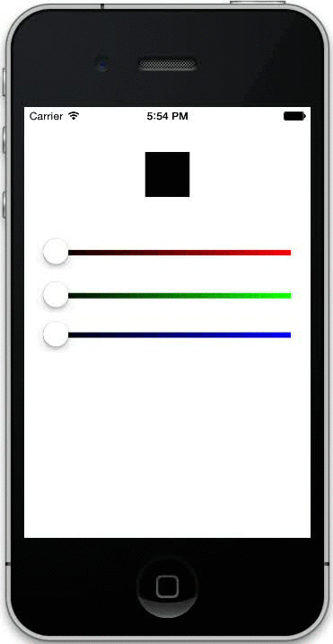
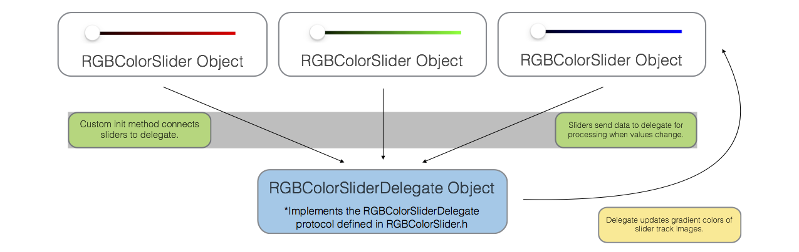

# RGBColorSlider

RGBColorSlider provides a simple way to add RGB sliders that dynamically respond to each other and change their appearances to give users an intuitive way to pick colors.



## Installation

RGBColorSlider is available through [CocoaPods](http://cocoapods.org). To install:

1. Add `pod 'RGBColorSlider'` to your `Podfile`
2. In your terminal run `$ pod install` and open your workspace `$ open yourApp.xcworkspace`

To install manually, copy the `Classes` folder into your project.

#### Requirements
RGBColorSlider uses ARC and is targeted for iOS 7.0.

## Usage

To use RGBColorSlider in your project, you need to include the following

    #import "RGBColorSlider.h"
    #import "RGBColorSliderDelegate.h"

To recieve color change updates, your view controller must adopt the `RGBColorSliderDataOutput` protocol, which has one required method

```objective-c
@interface YourViewController () <RGBColorSliderDataOutlet>
```
```objective-c
- (void)updateColor:(UIColor *)color
{
	// ... Do something ...
}
```

## Example

To create a new RGBColorSlider, you first need to initialize a `RGBColorSliderDelegate` object
```objective-c
RGBColorSliderDelegate *delegate = [[RGBColorSliderDelegate alloc] init];
```

Then use the following method to create a slider
```objective-c
- (id)initWithFrame:(CGRect)frame sliderColor:(RGBColorType)color trackHeight:(float)height delegate:(id<RGBColorSliderDelegate>)delegate
```

Creating red, green, and blue sliders would look something like:  
```objective-c
RGBColorSliderDelegate *delegate = [[RGBColorSliderDelegate alloc] init];
delegate.delegate = self;  

RGBColorSlider *redSlider = [[RGBColorSlider alloc] initWithFrame:CGRectMake(20, 140, 280, 44) sliderColor:RGBColorTypeRed trackHeight:6 delegate:delegate];
RGBColorSlider *greenSlider = [[RGBColorSlider alloc] initWithFrame:CGRectMake(20, 188, 280, 44) sliderColor:RGBColorTypeGreen trackHeight:6 delegate:delegate];
RGBColorSlider *blueSlider = [[RGBColorSlider alloc] initWithFrame:CGRectMake(20, 232, 280, 44) sliderColor:RGBColorTypeBlue trackHeight:6 delegate:delegate];

[self.view addSubview:redSlider];
[self.view addSubview:greenSlider];
[self.view addSubview:blueSlider];
```
*Note that you need to set the RGBColorSliderDelegate's delegate to `self` to enable reporting of the updated color when a slider value is changed.*

In the example project, `-updateColor:` changes the background color of a UIView to display the current color based on each slider value.


## Design

### [RGBColorSlider.h](https://github.com/eappel/RGBColorSlider/blob/master/Classes/RGBColorSlider.h)  [/ .m](https://github.com/eappel/RGBColorSlider/blob/master/Classes/RGBColorSlider.m)

RGBColorSlider is a subclass of [UISlider](https://developer.apple.com/library/ios/documentation/uikit/reference/UISlider_Class/Reference/Reference.html)

###### Properties
```objective-c
@property (nonatomic, readonly) id<RGBColorSliderDelegate> delegate;
@property (nonatomic, assign, readonly) RGBColorType sliderColor;
@property (nonatomic, assign, readonly) float trackHeight;
```
###### Methods
```objective-c
- (id)initWithFrame:(CGRect)frame sliderColor:(RGBColorType)color trackHeight:(float)height delegate:(id<RGBColorSliderDelegate>)delegate;
- (void)connectToDelegate:(id<RGBColorSliderDelegate>)delegate
- (void)valueDidChange:(RGBColorSlider *)sender
```
The [header file](https://github.com/eappel/RGBColorSlider/blob/master/Classes/RGBColorSlider.h) also defines the RGBColorSliderDelegate protocol to be adopted by the [delegate object](https://github.com/eappel/RGBColorSlider/blob/master/Classes/RGBColorSliderDelegate.h)
```objective-c
@protocol RGBColorSliderDelegate <NSObject>
- (void)slider:(RGBColorSlider *)sender valueDidChangeTo:(float)value forSliderColor:(RGBColorType)color;
- (void)connectSlider:(RGBColorSlider *)sender toColor:(RGBColorType)color;
@end
```
Using a RGBColorSlider requires the use of the custom init method (`-initWithFrame:sliderColor:trackHeight:delegate:`) to specify which type of slider you want to create (i.e. red, green, or blue), how tall the slider bar will be, and the delegate of the slider.  Because of this, the delegate object needs to be created before the sliders.  Be sure to pass the same delegate to each slider you are using to enable them to react to each other.

When a slider is created, a few things happen:

1. An action is specified for `UIControlEventValueChanged`.  This creates a connection between the slider and method so that whenever the slider's value changes, `-valueDidChange:` gets called.  
2. The slider's `sliderColor` and `trackHeight` are configured.  
3. `-connectToDelegate:` is called, which connects the slider to its delegate.

### [RGBColorSliderDelegate.h](https://github.com/eappel/RGBColorSlider/blob/master/Classes/RGBColorSliderDelegate.h)   [/ .m](https://github.com/eappel/RGBColorSlider/blob/master/Classes/RGBColorSliderDelegate.m)

RGBColorSliderDelegate manages the colors of RGBColorSlider objects.  When `-connectToDelegate:` in [RGBColorSlider.m](https://github.com/eappel/RGBColorSlider/blob/master/Classes/RGBColorSliderDelegate.m) is called, a degate method (`-connectSlider:toColor:`)  assigns the slider object to the correct property in the delegate object.  Depending on the slider's color, one of the following properties will be set
```objective-c
@property (nonatomic, strong) RGBColorSlider *redSlider;
@property (nonatomic, strong) RGBColorSlider *greenSlider;
@property (nonatomic, strong) RGBColorSlider *blueSlider;
@property (nonatomic, strong) RGBColorSlider *alphaSlider;
```

When a slider's value is changed, `-slider:valueDidChangeTo:forSliderColor:` calls `-setMinSliderTrackImage:forColor:` and `-setMaxSliderTrackImage:forColor:` to update the bar colors for each slider.

>`-setMinSliderTrackImage:forColor:` and `-setMaxSliderTrackImage:forColor:` work by redrawring a stretchable, 20px wide gradient into an image context that then gets set as the track image for a slider.  To calculate the gradient colors, the methods compute the left (minimum) color as if the current slider were set to zero and the other sliders stayed the same, and the right (maximum) color as if the current slider were set to 1.0 and the other sliders stayed the same.

Lastly, 
```objective-c
[self.delegate updateColor:updatedColor];
```
is called from `-slider:valueDidChangeTo:forSliderColor:` to update the aggregate color in the RGBColorSliderDelegate's delegate, which should be the view controller where the RGBColorSlider and RGBColorSliderDelegate objects are created. It is essential that the view controller conforms to the RGBColorSliderDataOutlet protocol in order to be notified when the color changes.  

[RGBColorSliderDelegate's header file](https://github.com/eappel/RGBColorSlider/blob/master/Classes/RGBColorSliderDelegate.h) declares the protocol with just a single method:
```objective-c
@protocol RGBColorSliderDataOutlet <NSObject>
- (void)updateColor:(UIColor *)color;
@end
```
Recall that to have your view controller conform to the RGBColorSliderDataOutlet protocol, simply include the following in your implementation file

```objective-c
@interface YourViewController () <RGBColorSliderDataOutlet>
```
```objective-c
- (void)updateColor:(UIColor *)color
{
    // ... Do something ...
}
```

### Diagram

The diagram below illustrates the relationship between the classes used in this project



## FAQ

##### Do I need to use all three sliders?  
No.  The code will work if you use any combination of sliders.

##### What about an alpha slider?  
To add a an alpha slider, create an RGBColorSlider just like you would a red, green, or blue slider, but pass `RGBColorTypeAlpha` to the color parameter.

##### The `-updateColor` method works great but how can I get the current color without waiting for the user to interact with a slider?  
To fetch the current color at a specific point in time, use the following methods declared in `RGBColorSliderDelegate.h`
```objective-c
- (UIColor *)getCurrentColor;
- (float)getRedColorComponent;
- (float)getGreenColorComponent;
- (float)getBlueColorComponent;
- (float)getAlphaComponent;
```
*Note that color components are stored as values between 0 and 1. To convert to RGB scale, multiply by 255.*

## License

RGBColorSlider is available under the MIT license. See the [LICENSE](https://github.com/eappel/RGBColorSlider/blob/master/LICENSE) file for more info.

